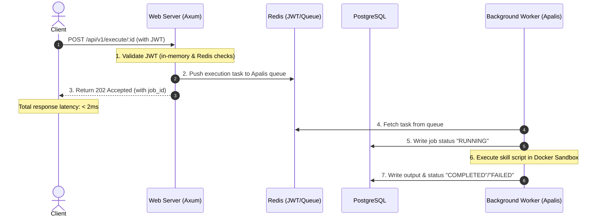

# 🏗️ Architecture & Design Spec

This document details the architectural layout, Cargo Workspace components, and processing pipelines designed for **Takdir**.

## 📁 Cargo Workspace Layout

```
takdir/
├── Cargo.toml
├── bins/
│   ├── takdir-api/      # Web API server binary (Axum)
│   └── takdir-admin/    # Seeding & configuration CLI tool
├── libs/
│   └── takdir-core/     # Database models, hashing (Argon2), JWT token claims
└── doc/                 # Technical documentation
```

### Component Details
1. **`takdir-core`**: The single source of truth for schema definitions, database queries, password hashing (`argon2id`), and cryptographically signing/verifying JWTs.
2. **`takdir-api`**: Exposes the REST endpoints, implements authorisation middleware, runs token revocation denylists, and submits tasks to the Redis queue.
3. **`takdir-admin`**: A command-line utility used by operators to seed the database with initial users, configure security settings, and reset access tokens on the host.

---

## ⚡ Asynchronous Request Handoff Pipeline

To meet the requirement of absolute minimum latency, the API server never executes skills or external AI calls synchronously within the HTTP request thread. It uses an asynchronous queue pattern:



### Safety & Isolation Details
- **Docker Sandboxing:** Executed scripts/tools run inside a restricted container managed via `bollard`.
- **Network Isolation:** Sandbox containers run with `--network none` to prevent unauthorised outbound connections or data exfiltration.
- **Watchdog:** A container cleanup watchdog runs on API startup to identify and clean up orphaned Docker containers (`takdir-job-<uuid>`).
